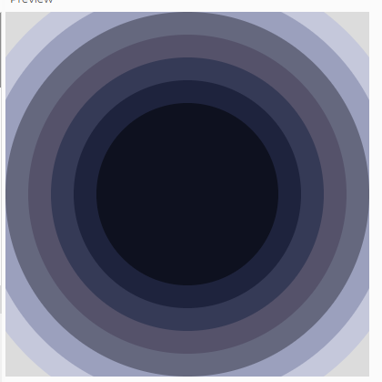

# **Alice Fogg *CART253***
## A continually updating website to display and collect prototyping work for CART253

This website serves as a place to compile work created for CART253, Including a [Reflective Journal](https://github.com/AliceFogg/Cart253Alice/blob/main/topics/Journal.md) which will be updated weekly.  

## Useful links:

## Prototypes:

### Instructions prototype: Abstract void

[link to code](https://github.com/AliceFogg/Cart253Alice/tree/main/topics/Instructions-prototype-Abstract-void/Abstract-void)

[link to running prototype](https://alicefogg.github.io/Cart253Alice/topics/Instructions-prototype-Abstract-void/Abstract-void/)

### Instructions prototype: Alien eyes 

[link to code](https://github.com/AliceFogg/Cart253Alice/tree/main/topics/Instructions-prototype-Alieneyes/)

[link to running prototype](https://alicefogg.github.io/Cart253Alice/topics/Instructions-prototype-Alieneyes/)

### Instructions prototype: Sad face 

[link to code](https://github.com/AliceFogg/Cart253Alice/tree/main/topics/Instructions-prototype-SadFace/)

[link to running prototype](https://alicefogg.github.io/Cart253Alice/topics/Instructions-prototype-SadFace/)

### Variables prototype: Bead Monger!

[link to code](https://github.com/AliceFogg/Cart253Alice/tree/main/topics/Prototype-Variables-beads/)

[link to running prototype](https://alicefogg.github.io/Cart253Alice/topics/Prototype-Variables-beads/)

### Variables prototype: Bubble Blower

[link to code](https://github.com/AliceFogg/Cart253Alice/tree/main/topics/Prototype-Variables-bubble-blower)

[link to running prototype](https://alicefogg.github.io/Cart253Alice/topics/Prototype-Variables-bubble-blower)

### Variables prototype: Button Game

[link to code](https://github.com/AliceFogg/Cart253Alice/tree/main/topics/Prototype-Variables-button-game/)

[link to running prototype](https://alicefogg.github.io/Cart253Alice/topics/Prototype-Variables-button-game/)
